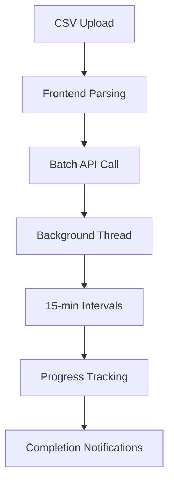
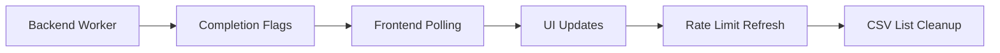

# X Unfollow App - Complete Architecture Analysis

## Project Structure Overview

### **Core Application Files:**
- **app.py** (868 lines) - Main Flask web application and batch processing logic
- **api.py** (781 lines) - X API v2 client with OAuth 2.0 and rate limiting
- **config.py** (121 lines) - Configuration settings and constants
- **automated_unfollow.py** (300 lines) - Command-line automation script

### **Frontend Files:**
- **templates/index.html** (316 lines) - Single-page web interface
- **static/js/script.js** (1116 lines) - Complex frontend JavaScript application
- **static/css/style.css** (382 lines) - Custom styling and X-themed design

### **Data & Configuration:**
- **requirements.txt** - 6 Python dependencies
- **unfollow_tracking.json** - Persistent tracking of unfollow attempts
- **.env.example** - Environment variable template

---

## Data Flow Architecture

### **Authentication Flow:**
```mermaid
graph LR
    A[User] --> B[/login]
    B --> C[X OAuth]
    C --> D[/callback]
    D --> E[Session Storage]
    E --> F[Rate Limit Check]
```

### **Batch Unfollow Flow:**


### **Real-time Updates:**


---

## Major Functions & Operations

### **Backend (app.py):**

#### **OAuth Management:**
- `login()` - Initiate OAuth flow with X
- `callback()` - Handle OAuth callback and token exchange
- `logout()` - Clear session and tokens

#### **Batch Processing:**
- `slow_batch_worker()` - Main 15-minute interval worker (lines 398-763)
- `track_unfollow_attempt()` - Persistent unfollow tracking (lines 160-190)
- `get_unfollow_stats()` - Current unfollow statistics (lines 192-213)

#### **Queue Management:**
- `start_next_queued_batch()` - Auto-start queued operations (lines 72-95)
- `get_active_batch_count()` - Count active batches for user (lines 47-62)
- `cleanup_old_operations()` - Memory management (lines 97-125)

#### **Operation Management:**
- `unfollow_slow_batch()` - Create and queue batch operations (lines 765-880)
- `cancel_slow_batch()` - Cancel running operations (lines 944-1000)
- `list_slow_batch_operations()` - Get user's operations (lines 1004-1054)

### **API Client (api.py):**

#### **OAuth 2.0 PKCE:**
- `get_authorization_url()` - Generate OAuth URL (lines 60-87)
- `exchange_code_for_tokens()` - Token exchange (lines 89-138)
- `refresh_access_token()` - Token refresh (lines 140-185)

#### **Rate Limiting:**
- `_check_rate_limit()` - Pre-request rate limit check (lines 238-271)
- `_update_rate_limit()` - Update limits from API response (lines 273-346)
- `get_rate_limit_status()` - Current limit status (lines 544-610)

#### **Core Operations:**
- `unfollow_user()` - Single unfollow operation (lines 516-542)
- `resolve_username_to_id()` - Username to ID conversion (lines 431-463)
- `get_following_list()` - Retrieve following list (lines 465-514)

#### **Adaptive Features:**
- `discover_account_rate_limits()` - Auto-detect limits (lines 661-728)
- `get_adaptive_rate_limits()` - Smart limit recommendations (lines 730-781)

### **Frontend (script.js):**

#### **CSV Processing:**
- `handleCSVUpload()` - File upload and parsing (lines 284-318)
- `parseCSV()` - CSV format parsing (lines 320-348)
- `renderCSVList()` - Display user list (lines 360-400)
- `removeUsernameFromList()` - Auto-cleanup after unfollow (lines 79-92)

#### **Batch Management:**
- `handleBatchUnfollow()` - Start batch operations (lines 448-519)
- `loadSlowBatchOperations()` - Load operation status (lines 722-761)
- `renderSlowBatchOperations()` - Display active operations (lines 913-987)

#### **Smart Polling:**
- `scheduleSmartCheck()` - Intelligent polling timing (lines 850-875)
- `calculateNextUnfollowTime()` - Predict next unfollow (lines 877-907)
- `manualRefresh()` - User-triggered refresh (lines 778-806)

#### **UI State Management:**
- `showStatus()` - Status message display (lines 561-593)
- `updateRateLimitDisplay()` - Rate limit UI updates (lines 214-251)
- `checkAuthStatus()` - Authentication state check (lines 154-196)

---

## State Management Analysis

### **Backend State:**
- **Global Variables:** `slow_batch_operations{}`, `batch_queue[]`
- **Persistent Files:** `unfollow_tracking.json` (24-hour rolling window)
- **Session Storage:** User authentication, rate limits via Flask sessions
- **Memory Management:** Old operation cleanup every 24 hours

### **Frontend State:**
- **JavaScript Objects:** `csvUserList[]`, `selectedUsers Set()`, `rateLimits{}`
- **localStorage:** CSV list persistence across browser sessions
- **Real-time Tracking:** Smart polling based on expected unfollow times

### **Synchronization Issues:**
- **Completion Notifications:** Backend flags → Frontend polling detection
- **Rate Limit Updates:** API responses → Cached limits → UI display
- **CSV Cleanup:** Successful unfollows automatically removed from frontend list

---

## User Interaction Points

### **Authentication:**
- **Login Button** → X OAuth flow (`templates/index.html:95-97`)
- **Logout Button** → Session clear + token cleanup (`templates/index.html:32-35`)

### **CSV Management:**
- **File Upload Input** → CSV parsing and validation (`templates/index.html:285-290`)
- **Select All/None Buttons** → Bulk selection management (`templates/index.html:171-176`)
- **Individual Checkboxes** → Per-user selection (dynamically generated)
- **Clear List Button** → Complete CSV reset (`templates/index.html:177-179`)

### **Batch Operations:**
- **Start Batch Button** → Confirmation dialog → Queue/Start batch (`templates/index.html:203-207`)
- **Cancel Operation** → Immediate batch termination (dynamically generated)
- **View Details** → Real-time operation status (dynamically generated)
- **Clear All Batches** → Debug operation cleanup (`templates/index.html:138-140`)

### **Real-time Monitoring:**
- **Progress Bars** → Visual completion tracking (dynamically generated)
- **Rate Limit Badges** → Current API limit status (`templates/index.html:47-53`)
- **Operation Timers** → Elapsed time display (`script.js:22-55`)
- **Status Messages** → Success/error feedback (`templates/index.html:109-126`)

---

## Error Handling Patterns

### **Authentication Errors:**
- **OAuth Failures:** URL parameter extraction → User-friendly error display (`script.js:538-559`)
- **Token Expiration:** Automatic refresh → Fallback to re-authentication (`api.py:396-402`)
- **Client Configuration:** Detailed troubleshooting guidance in UI (`templates/index.html:84-91`)

### **API Errors:**
- **Rate Limiting:** Exception throwing → 15-minute wait enforcement (`api.py:266-270`)
- **User Not Found:** Skip with logging → Continue batch processing (`api.py:452-453`)
- **Network Failures:** Retry logic → Error tracking → Operation continuation (scattered)

### **Batch Processing Errors:**
- **Worker Crashes:** Try-catch wrapper → Graceful operation termination (`app.py:744-763`)
- **Queue Management:** Thread-safe operations → Automatic next batch starting (`app.py:72-95`)
- **Memory Issues:** Result trimming → Old operation cleanup (`app.py:687-691`)

### **Frontend Error Handling:**
- **Network Failures:** Fetch error catching → User notification (`script.js:various`)
- **CSV Parsing:** Validation → Format guidance → Partial success reporting (`script.js:284-318`)
- **UI State Conflicts:** Debounced updates → Smart polling coordination (`script.js:850-875`)

---

## External Dependencies

### **Python Backend:**
- **Flask 2.3.2** - Web framework and session management
- **requests 2.31.0** - HTTP client for X API calls
- **requests-oauthlib 1.3.1** - OAuth 2.0 PKCE implementation
- **keyring 24.2.0** - Secure token storage (OS keychain)
- **python-dotenv 1.0.0** - Environment variable management
- **Werkzeug 2.3.6** - WSGI utilities and development server

### **Frontend Dependencies:**
- **Bootstrap 5.1.3** - UI framework and responsive design
- **Font Awesome 6.0.0** - Icons and visual elements
- **Vanilla JavaScript** - No additional JS frameworks

### **X API Integration:**
- **X API v2** - OAuth 2.0, user lookup, following management
- **Rate Limits:** 15-minute windows, varying limits per endpoint
- **Required Scopes:** tweet.read, users.read, follows.read, follows.write

---

## Critical Architecture Issues

### **1. State Management Fragmentation**
**Problem:** No centralized state management
- Backend uses global variables + persistent files + session storage
- Frontend uses JavaScript objects + localStorage + real-time polling
- State synchronization through multiple channels creates race conditions

**Impact:** Inconsistent data, race conditions, difficult debugging

### **2. Error Handling Scattered**
**Problem:** Inconsistent error patterns
- Mix of exception throwing, return value checking, and logging
- Different error types use different notification methods
- Recovery strategies vary between components

**Impact:** Poor user experience, unreliable error recovery

### **3. Complex Timing Logic**
**Problem:** Multiple overlapping timing systems
- Smart polling, completion notifications, manual refresh
- Timer management spread across frontend and backend
- Race conditions between polling and completion detection

**Impact:** UI inconsistencies, unnecessary API calls, timing conflicts

### **4. Mixed Responsibilities**
**Problem:** Single files handling multiple concerns
- `app.py`: web routes + batch processing + queue management
- `script.js`: UI state + business logic + API communication
- `api.py`: API calls + rate limiting + error handling

**Impact:** Difficult maintenance, cascading changes, testing complexity

### **5. Data Flow Complexity**
**Problem:** Unclear data transformation paths
- CSV data flows through multiple transformations
- Rate limit data cached in multiple places
- Operation status synchronized through multiple channels

**Impact:** Data inconsistencies, performance issues, debugging difficulty

---

## Refactoring Opportunities

### **1. Centralized State Management**
- Single source of truth for operation status
- Unified rate limit management
- Consistent data synchronization

### **2. Separated Concerns**
- Distinct modules for API, batch processing, and UI logic
- Clear interface boundaries
- Single responsibility per module

### **3. Unified Error Handling**
- Consistent error recovery patterns
- Centralized error classification
- Progressive error escalation

### **4. Simplified Data Flow**
- Clear data transformation pipeline
- Reduced data duplication
- Optimized synchronization

### **5. Configuration Management**
- Environment-based settings
- Centralized configuration
- Runtime configuration validation

---

## Performance Analysis

### **Current Performance Issues:**
1. **Excessive API Calls:** Multiple polling mechanisms
2. **Memory Leaks:** Long-running operations without cleanup
3. **UI Blocking:** Synchronous operations in main thread
4. **Network Inefficiency:** Redundant rate limit checks

### **Optimization Opportunities:**
1. **Smart Polling:** Context-aware refresh timing
2. **Request Batching:** Combine multiple API calls
3. **Caching Strategy:** Intelligent data caching
4. **Lazy Loading:** On-demand data loading

---

## Security Considerations

### **Current Security Measures:**
- OAuth 2.0 PKCE implementation
- Secure token storage via OS keychain
- CSRF protection in OAuth flow
- Rate limiting to prevent abuse

### **Security Concerns:**
- Session management complexity
- Token refresh timing vulnerabilities
- Client-side data exposure
- Debug endpoints in production

---

## Testing Strategy Requirements

### **Unit Testing Needs:**
- Error classification logic
- Rate limit calculations
- CSV parsing functions
- Authentication flows

### **Integration Testing Needs:**
- API client with rate limiting
- Batch processing workflows
- UI state synchronization
- Error recovery paths

### **End-to-End Testing Needs:**
- Complete user workflows
- Long-running batch operations
- Network failure scenarios
- Authentication edge cases

---

## Conclusion

The X Unfollow App has grown into a complex system with multiple interconnected components. While it provides comprehensive functionality, the architecture has evolved organically, leading to:

1. **Fragmented state management**
2. **Scattered error handling**
3. **Complex timing logic**
4. **Mixed responsibilities**
5. **Unclear data flows**

The systematic refactoring approach outlined in the Development Pivot Plan will address these issues layer by layer, ensuring each improvement builds on a solid foundation without introducing new conflicts.

**Immediate Priority:** Begin with Layer 1 implementation to establish clean basic functionality before adding complexity.